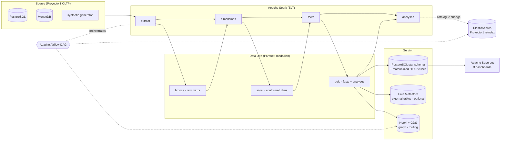

# restaurantes-e2-analytics

**A lakehouse + data-warehouse analytics platform for a distributed restaurant
backend** — Spark ELT, a star-schema warehouse with materialized OLAP cubes,
Neo4j graph analytics, delivery-route optimisation, Airflow orchestration and
Superset dashboards.

This is the analytics half (Proyecto 2) of a two-repository system. The
transactional backend it analyses lives in
[`polyglot-restaurant-platform`](https://github.com/luismeza5/polyglot-restaurant-platform) (Proyecto 1:
FastAPI · PostgreSQL · MongoDB · Redis · ElasticSearch). This repo is
**self-contained**: a synthetic data generator reproduces Proyecto 1's entities
and extends them with Greater Metropolitan Area locations and customer
referrals, so everything runs end to end without standing up the backend first.

> Course: *Bases de Datos II*, Tecnológico de Costa Rica (individual project).
> Code is in English; the technical documentation under [`docs/`](docs) is in
> Spanish.

---

## Architecture



**Design decision — why a Postgres star schema for serving and Hive for the
lake.** The course brief asked for an open-source warehouse "like Apache Hive". I use a
**medallion lake in Parquet** registered in a **Hive Metastore** (the open
SQL-on-lakehouse layer) *and* a **PostgreSQL star schema with materialized-view
OLAP cubes** as the low-latency serving layer Superset reads. Postgres
`ROLLUP`/`CUBE`/`GROUPING SETS` give true multi-level OLAP aggregations with
sub-second refresh and rock-solid BI connectivity, while Hive keeps the raw
columnar data open to any metastore-aware engine (Trino, Spark SQL). Same data,
two access paths — explained in [`docs/architecture.md`](docs/architecture.md).

---

## Requirements coverage

| # | Requirement | Where |
|---|-------------|-------|
| 1 | Data Warehouse + OLAP (star schema, ≥5 cubes by time/location/product/frequency) | [`warehouse/ddl`](warehouse/ddl) — 6 cubes via `ROLLUP`/`CUBE`/`GROUPING SETS` |
| 2 | Apache Spark (DataFrames + SparkSQL, ≥3 analyses) | [`spark/jobs/analyses.py`](spark/jobs/analyses.py) — trends, peak hours, monthly growth |
| 3 | Visualization (≥3 dashboards) | [`dashboards/`](dashboards) — Superset, SQL + bootstrap |
| 4 | Airflow (extract → Spark → load DW → reindex ES) | [`airflow/dags`](airflow/dags) |
| 5 | Neo4J (co-purchase, influencers, routing paths) | [`neo4j/`](neo4j) — loader + Cypher + GDS |
| 6 | Delivery routing (geolocation, nearest-neighbour / graph) | [`neo4j/routing`](neo4j/routing) — NN + 2-opt |
| 7 | Technical documentation (Spanish) | [`docs/`](docs) |

---

## Quickstart

### Run the whole stack (Docker)

```bash
cp .env.example .env
make seed              # generate synthetic source (≈50k orders)
make up                # warehouse + neo4j + airflow + superset
#   ↳ Airflow  http://localhost:8080   (admin/admin)
#   ↳ Superset http://localhost:8088   (admin/admin)
#   ↳ Neo4j    http://localhost:7474   (neo4j/neo4jpass)
make etl               # trigger the ELT DAG once
make neo4j             # load the graph
make routing           # optimise courier routes -> routes.json
make dashboards        # register Superset datasets
```

Add the open lakehouse (Hive Metastore) with `make up-lake`.

### Run the pipeline locally (no Docker)

Needs Python 3.11 + Java 17:

```bash
pip install -r requirements.txt
make seed
make etl-local         # Spark in local[*] -> Parquet lake under .lake/
make test              # unit + integrity tests
```

---

## What's inside

```
warehouse/ddl/     star schema · 6 OLAP cubes · analysis tables · indexes
spark/             session/lib + 5 jobs (extract→dimensions→facts→analyses→load)
airflow/dags/      the restaurant_analytics DAG
neo4j/             graph loader · Cypher catalogue · routing heuristics
dashboards/        Superset SQL datasets · bootstrap · import guide
data/              self-contained synthetic source generator
tests/             transforms (chispa-style) · DAG · warehouse integrity
docs/              Spanish technical report + design docs
infra/             Airflow image · Hive metastore config
```

## Tech stack

Apache Spark 3.5 · PostgreSQL 16 · Apache Hive Metastore 4 · Neo4j 5 + Graph Data
Science · Apache Airflow 2.9 · Apache Superset 3 · Docker Compose · pandas/pyarrow.

## Author

**Luis Ángel Meza Chavarría** · [github.com/luismeza5](https://github.com/luismeza5)

## License

MIT — see [LICENSE](LICENSE).
