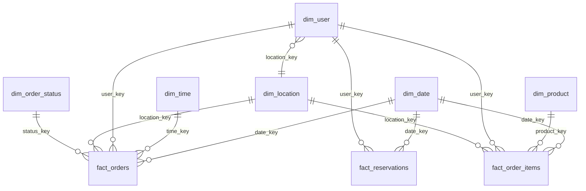

# Modelo dimensional

Esquema **estrella** (con un copo de nieve ligero: `dim_user → dim_location`).
Todas las claves de unión son **claves sustitutas** enteras generadas por Spark;
las claves naturales del OLTP se conservan para trazabilidad.

## Dimensiones conformadas

| Dimensión | Grano | Atributos clave |
|-----------|-------|-----------------|
| `dim_date` | día | `date_key` (yyyymmdd), año, trimestre, mes (nombre en español), `month_label`, día de semana ISO, fin de semana |
| `dim_time` | hora del día (0–23) | `hour_label`, `daypart` (madrugada/mañana/tarde/noche) |
| `dim_user` | cliente | `user_id`, nombre, email, fecha de alta, `location_key` |
| `dim_product` | producto | `product_id`, nombre, **categoría (desnormalizada)**, precio unitario, activo |
| `dim_location` | zona geográfica GAM | provincia, cantón, distrito, zona, lat/long |
| `dim_order_status` | estado | `status`, `is_completed`, `is_cancelled` |

## Tablas de hechos

| Hecho | Grano | Medidas aditivas | Degeneradas / flags |
|-------|-------|------------------|---------------------|
| `fact_orders` | una fila por pedido (cabecera) | `item_count`, `gross_amount`, `discount_amount`, `net_amount`, `delivery_km` | `order_id`, `is_completed`, `is_cancelled` |
| `fact_order_items` | una fila por línea de pedido | `quantity`, `line_amount` | `order_id` |
| `fact_reservations` | una fila por reserva | `party_size` | `is_honored`, `is_no_show` |

`fact_order_items` es el hecho principal para análisis de producto; `fact_orders`
para análisis de cabecera (ingresos, cancelaciones, reparto).

## Diagrama (estrella)

## Notas de carga

- Las dimensiones se cargan **antes** que los hechos (integridad referencial: los
  hechos tienen claves foráneas hacia las dimensiones).
- `dim_location` y `dim_user` arrastran una columna auxiliar `_nat_location_id`
  durante el cómputo en Spark para resolver claves foráneas; se elimina antes de
  cargar al warehouse.
- La carga es *truncate + insert* (recarga completa idempotente) en esta versión;
  el diseño admite migrar a *upsert* incremental por `date_key`.
